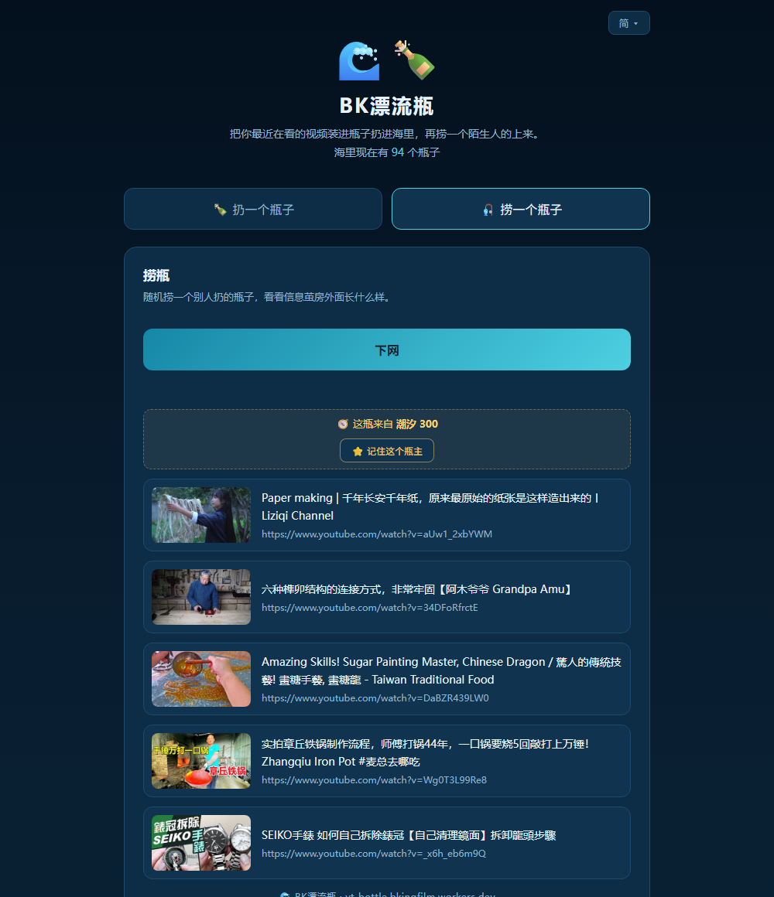

# BK漂流瓶

把你最近真的在看的视频装进瓶子扔进海里，再捞一个陌生人的瓶子上来。

不用注册，不读你的浏览记录，没有算法推荐。

**线上：https://yt-bottle.bkingfilm.workers.dev**

支持 YouTube（视频和播放列表）和 B站，一个瓶子里可以混着装。



## 为什么做这个

算法喂给你的东西越来越像你已经点过的东西。这是一条手工的出路：真人挑几条自己正在看的扔进来，你随机捞一个回去。不是算法猜出来的「相似但不同」，是一个陌生人真实的晚上。

学术界做过很接近的东西。[OtherTube](https://dl.acm.org/doi/10.1145/3491102.3502028)（CHI 2022）用 41 人 10 天的实验证明了和陌生人交换推荐确实能让人发现新兴趣，TheirTube 和 FlipFeed 探索过相邻的思路。它们全是研究原型，现在都没了。这个是产品，会一直开着。

## 不做什么

- **不读你的浏览记录。** 网页根本没有这个 API，就算有也不该用。完整的观看历史能反推出的东西远超一个人愿意分享的范围。你自己挑几条链接贴进来，这就是全部的隐私模型。
- **不要账号。** 身份是浏览器 localStorage 里的一串随机 id，哈希成「灯塔 280」这样的稳定代号，服务器不知道你的任何其他信息。
- **没有留言和评论。** 任何自由文本框最后都会变成广告牌，瓶子里只放链接。
- **不按你的口味给你排序。** 好评会让一个瓶子更容易被捞到，但那份排序是全站共用的，跟捞瓶的人是谁无关。区别在这里：茧房不是「有排序」，是「排序因人而异」。所以「按你捞过的瓶子推荐相似的瓶子」这件事永远不做，加上它的那天，这个产品就变成了它想反对的东西。唯一沾这条边的是「记住某个瓶主」，那里留了三成随机当解药，别把它调到十成。

## Chrome 插件

`extension/` 里是插件版：新标签页就是一次捞瓶，YouTube 和 B站 的播放页多一个「装进瓶子」。

权限只要 `storage` 加三个域名，没有 `history`、没有 `tabs`、没有 `<all_urls>` —— 上面那条「不读你的浏览记录」在插件里也算数，虽然插件确实有这个 API。装载和上架说明见 [extension/README.md](extension/README.md)。

## 怎么实现的

一个 Cloudflare Worker 加 KV 存储，没有构建步骤，没有依赖。全部代码就是一个 HTML 文件和一个 JS 文件。

```
public/index.html     整个前端
worker/src/index.js   整个后端
server.py             本地开发服务器（只用标准库，不用装任何东西）
extension/            Chrome 插件(MV3),不写后端,只读 API
```

几个真正花了力气的地方：

- **每条链接都在服务端验证过。** 标题和封面在扔瓶时从 YouTube oEmbed 取，编造的视频 id 会被丢弃，全是假 id 的瓶子直接拒收。B站把 Cloudflare 机房 IP 整段封了（每个请求都返回 `-412`，换请求头没用），所以 B站 的元数据由扔瓶人自己的浏览器通过 JSONP 取回来，服务端只做清洗。
- **捞过的瓶子不会再出现。** 客户端把见过的清单发上来，服务端排除掉。把整片海捞空了会提示你扔一瓶回去。
- **按质量加权，只用正信号。** 好评记在 KV metadata 里，抬高被捞到的概率。没有任何信号会往下压，所以没有瓶子会被埋掉，区别只是先后。原来还有个「一般」按钮，2026-07-28 撤了：数据显示它被当成翻页键在点（33 次有意思对 70 次一般），拿它当差评等于给自己灌噪声，还逼着只想看下一个的人先给陌生人打个差评才能走。现在那个位置就叫「再捞一个」。
- **可以记住某个瓶主。** 遇到品味对味的陌生人可以记住他，之后七成的捞瓶来自他，剩下三成仍然完全随机。三成是故意留的，改成十成就等于亲手重建了你想逃离的茧房。
- **反滥用不写在界面上。** 每个 IP 每天限扔几瓶，同一频道占比过半的瓶子会被拒收，具体阈值不公开。规则只在你踩到的时候才露头。
- **KV 免费额度每天只有 1000 次写和 1000 次 list。** 第一版每次捞瓶都要 list 整个索引、还要写回一次被捞计数，几百次访问就烧掉一半额度。现在索引在 isolate 内存里缓存 60 秒，被捞计数十次抽样写一次。

## 自己跑一个

本地运行，不需要云账号：

```bash
python server.py       # http://127.0.0.1:8765
```

部署到 Cloudflare：

```bash
npm i -g wrangler
wrangler login
wrangler kv namespace create BOTTLES
cp wrangler.toml.example worker/wrangler.toml   # 把 namespace id 填进去
cd worker && wrangler deploy
```

后台数据页在 `/admin?key=...`，密钥用 `wrangler secret put ADMIN_KEY` 设置。

## 种子瓶

项目自带一批种子瓶，这样新部署一个实例不会是一片空海。里面都是真实存在的视频，人工挑的，挂在占位瓶主名下。

**但种子瓶是假的。** 它们不是任何一个真人「正在看的视频」，是为了不让海空着塞进去的填充物，跟「一个陌生人真实的晚上」这个承诺是相悖的。所以真人瓶起量之后，种子瓶就该退场。

2026-07-29 第一次退场：真人瓶 104 个已经远超种子瓶 42 个，把其中**从没有任何人点过「有意思」的 28 个删掉**，只留下 14 个被人认过的。退场前的完整内容备份在 `seed-retired-2026-07-29.json`。

需要说明的是，这 28 个里有 6 个（cn-life / mix-12 / mix-13 / oldweb / v2-03 / v2-07）是被捞 0 次，零好评是因为没机会而不是没人喜欢。删它们的理由是「假瓶该退场」，不是「内容不行」。

**以后再补种子瓶，方向是冷门、猎奇**（2026-07-29 BK 定）。理由是种子瓶唯一站得住的价值是提供算法给不到的东西；如果放大众都看过的热门内容，它既假又没用。

顺带一条边界：**不要按「好评率」筛内容。** 一旦把好评率当成要优化的指标，接下来必然是挑更容易讨好人的东西，那就是算法在做的事，只是策展人换成了人。一个陌生人的片单本来就大概率不对你的胃口，零好评是这个产品的自然状态，不是缺陷。种子瓶退场是「我们自己放的假东西该退场」，跟「判断别人的品味该不该被看见」是两件事。

用户扔进来的瓶子不会提交到这个仓库。

## License

MIT
